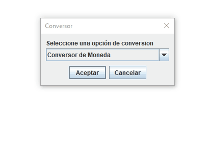

**<h1 style="color:rgb(52,152,219);font-family:Sans-serif">Conversor</h1>**

## Descripción
En este proyecto se realizó un programa en java para convertir diferentes tipos de unidades,
como : monedas, volumen, longitud y presión.

***

<section>
    <h2>índice</h2>
    <ul>
        <li><a href="#funcionalidad">Funcionalidades</a></li>
        <li><a href="#Ejecutar proyecto">Ejecutar el proyecto</a></li>
        <li><a href="#Tecnologias utilizadas">Tecnologías utilizadas</a></li>
        <li><a href="#Autor">Autor</a></li>
    </ul>
</section> 

***

<section id="funcionalidad">
    <h2> 💡Funcionalidad</h2>
    
    <ul>
        <li>Diferentes conversores</li>
        <li>Control de errores</li>
    </ul>
</section> 

***

<section id="Ejecutar proyecto">
    <h2>🚀 Ejecutar Proyecto</h2>
    Para ejecutar el proyecto, descargue el archivo Conversor.jar y ejecutelo
</section> 

***

<section id="Tecnologias utilizadas"> 
    <h2>📚 Tecnologías utilizadas</h2>
    <ul>
        <li>Java 8 </li>
        <li>Swing </li>
    </ul>
</section> 

***

<section id="Autor">
    <h2>👷 Autor</h2>
    <ul>
        <li>Daniel Caro - <a href="https://github.com/DanielC001">DanielC001</a> </li>
    </ul>
    
</section> 

